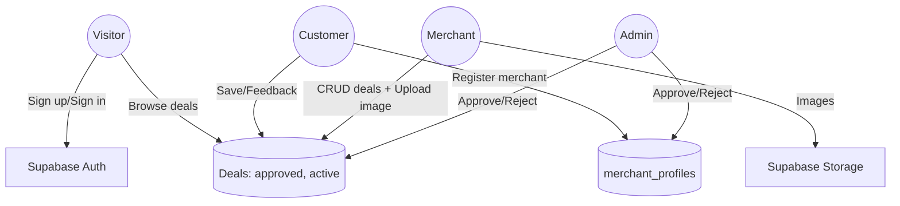

# Use Case Diagram — RwaDiscount

Actors
- Visitor: anyone browsing without authentication
- Customer: authenticated user with role=customer
- Merchant: authenticated user with role=merchant (with or without approved merchant_profile)
- Admin: authenticated user with role=admin
- Supabase: external system providing Auth, DB, Storage

Primary use cases
- Visitor
  - Sign up / Sign in
  - Browse approved, active deals
- Customer
  - Save deal, give feedback (thumbs up/down)
  - Search, filter, sort deals
  - Register to become a Merchant
- Merchant
  - Create/update/delete deal
  - Upload deal image to Storage
  - View stats (views, saves)
- Admin
  - Approve/reject merchant applications
  - Approve/reject deals
  - View platform stats

Mermaid (high-level)

Notes
- Public browsing is restricted to deals where status=approved and end_date>now().
- Role changes occur when a customer submits a merchant application and admins approve.
