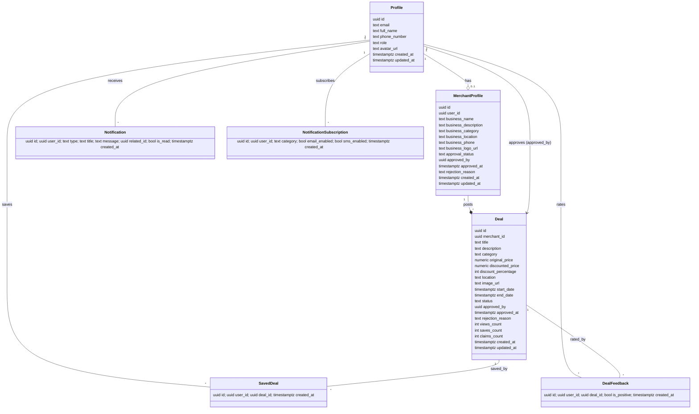

# Class Diagram — RwaDiscount

Scope: Domain model mapped from the SQL schema. Each table corresponds to a class.

Classes and key attributes
- Profile
  - id: uuid
  - email: text
  - full_name: text
  - phone_number: text?
  - role: {'customer','merchant','admin'}
  - avatar_url: text?
  - created_at, updated_at: timestamptz
- MerchantProfile
  - id: uuid
  - user_id: uuid (Profile)
  - business_name, description?, category, location, phone, logo_url?
  - approval_status: {'pending','approved','rejected'}
  - approved_by?: uuid (Profile), approved_at?, rejection_reason?
  - created_at, updated_at
- Deal
  - id: uuid
  - merchant_id: uuid (MerchantProfile)
  - title, description, category, location
  - original_price, discounted_price, discount_percentage
  - image_url?
  - start_date, end_date
  - status: {'pending','approved','rejected','expired'}
  - approved_by?: uuid (Profile), approved_at?, rejection_reason?
  - views_count, saves_count, claims_count
  - created_at, updated_at
- SavedDeal
  - id: uuid
  - user_id: uuid (Profile)
  - deal_id: uuid (Deal)
  - created_at
- DealFeedback
  - id: uuid
  - user_id: uuid (Profile)
  - deal_id: uuid (Deal)
  - is_positive: boolean
  - created_at
- Notification
  - id, user_id (Profile), type, title, message, related_id?, is_read, created_at
- NotificationSubscription
  - id, user_id (Profile), category, email_enabled, sms_enabled, created_at

Relationships (cardinalities)
- Profile 1 — 0..1 MerchantProfile (via user_id)
- MerchantProfile 1 — * Deal
- Profile 1 — * SavedDeal — * Deal (many-to-many via SavedDeal; UNIQUE(user_id,deal_id))
- Profile 1 — * DealFeedback — * Deal (many-to-many via DealFeedback; UNIQUE(user_id,deal_id))
- Profile 1 — * Notification
- Profile 1 — * NotificationSubscription (UNIQUE(user_id,category))
- Profile 1 — * Deal (as approver via approved_by)

Mermaid

Notes
- Constraints ensure discounted_price < original_price and end_date > start_date.
- Row Level Security policies in SQL enforce role-based access across these relationships.
