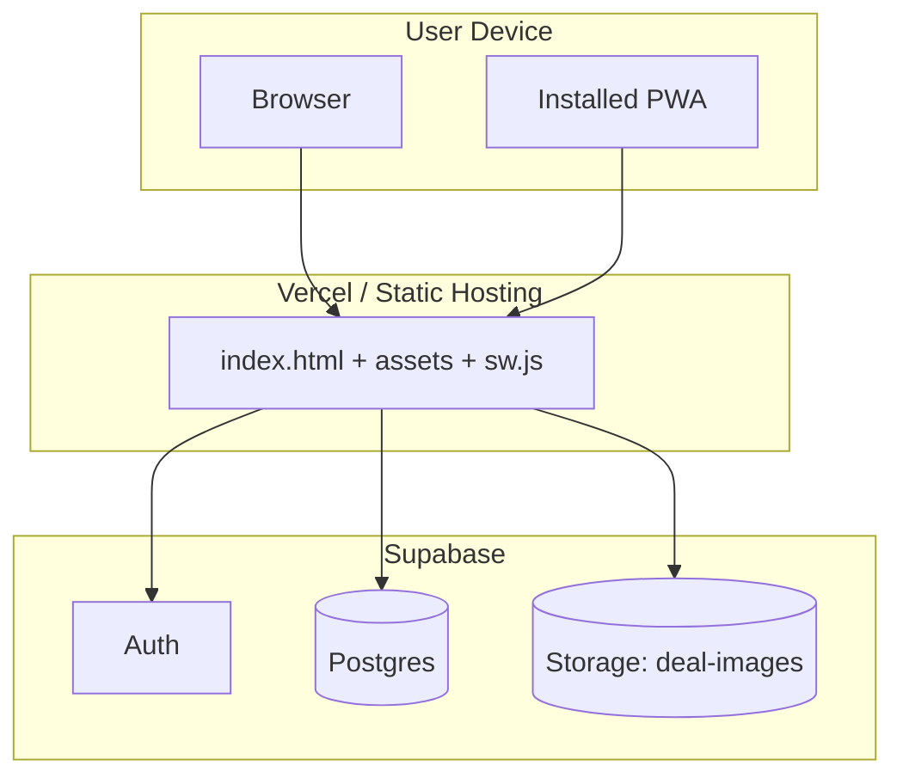

# Deployment Diagram — Runtime Nodes

Nodes and artifacts
- User Device
  - Mobile/Desktop Browser
  - PWA installed app (optional)
  - Artifact: RwaDiscount static bundle from Vite
- Hosting
  - Vercel (or similar static hosting) serving index.html, assets, sw.js, manifest
- Backend (Supabase)
  - Auth service
  - Postgres database
  - Storage bucket: deal-images

Mermaid

Notes
- The client communicates directly with Supabase; there is no custom backend server in this project.
- Service Worker provides caching and update prompts; manifest enables install.
