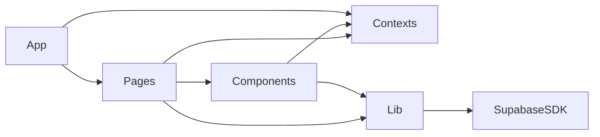

# Package Diagram — Source Organization

Packages (folders)
- src/pages
  - Home.tsx, SignIn.tsx, SignUp.tsx, MerchantRegister.tsx, CustomerDashboard.tsx, MerchantDashboard.tsx, AdminDashboard.tsx
- src/components
  - Header.tsx, DealCard.tsx, CreateDealModal.tsx
- src/contexts
  - AuthContext.tsx
- src/lib
  - supabase.ts, sw.ts
- Root
  - App.tsx (routes, ProtectedRoute)

Dependencies
- pages -> components, contexts, lib
- components -> contexts, lib (for data operations)
- App.tsx -> pages, contexts
- lib/supabase.ts -> @supabase/supabase-js
- lib/sw.ts -> browser Service Worker APIs

Mermaid

Notes
- Keep pages “thin” and reuse components for UI; domain data access is centralized through lib/supabase.ts and guarded by AuthContext where needed.
