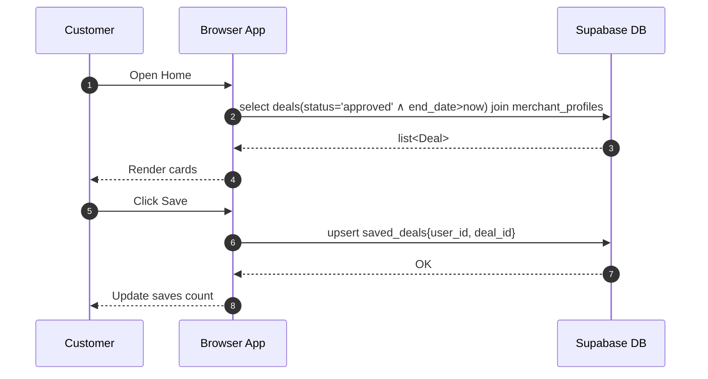

# Sequence Diagram — Customer browses and saves a deal

Participants
- Customer (User)
- Browser App (React)
- Supabase DB

Mermaid

Notes
- The app uses the Supabase JS client; authentication context ensures user_id is available for save operations.
- Views count increments on DealCard click (update deals.views_count).
