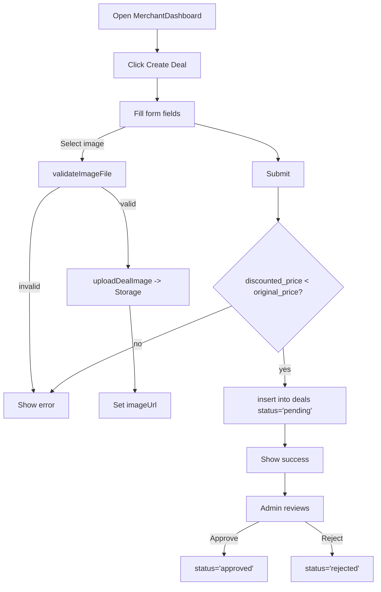

# Activity Diagram — Merchant creates a deal

Mermaid

Notes
- Form validation happens both client-side (price constraint) and server-side (DB constraints and policies).
- Image upload is independent of form submission; the modal stores storage path for cleanup.
