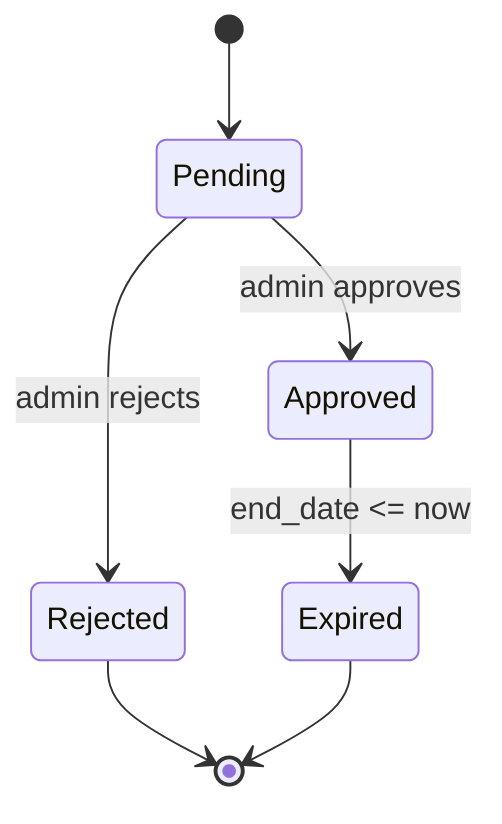

# State Machine Diagram — Deal lifecycle

States
- Draft (implicit in UI when editing a new deal)
- Pending
- Approved
- Rejected
- Expired

Mermaid

Notes
- Transitions to Expired are time-based checks (queries filter out expired deals).
- Counts (views/saves) are independent of status but only relevant while approved and before expiry.
