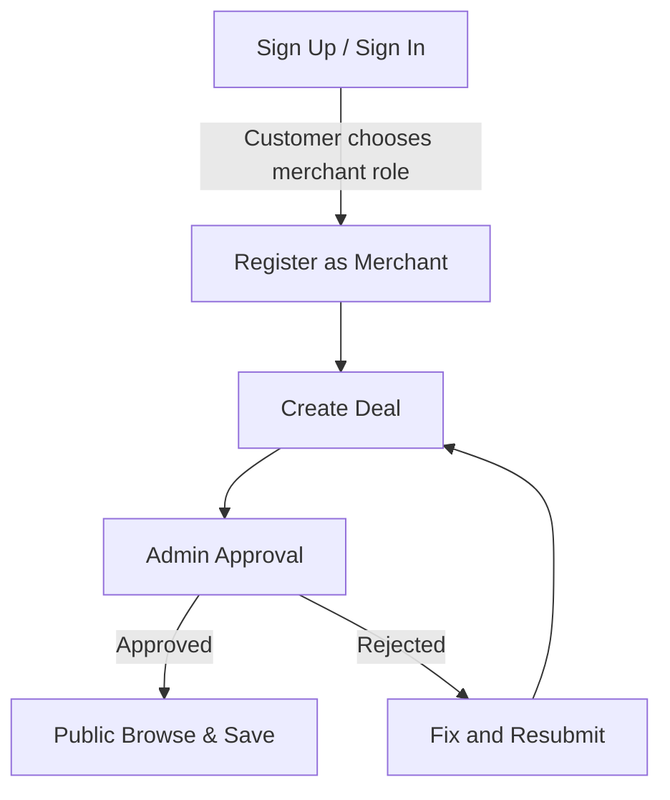

# Interaction Overview — End-to-end onboarding to deal discovery

Sub-activities (refer to their own sequence/activity diagrams)
- A1: Sign Up / Sign In
- A2: Register as Merchant
- A3: Create Deal (see activity diagram)
- A4: Admin Approval (see communication diagram)
- A5: Browse and Save (see sequence diagram)

Mermaid (simplified)

Notes
- This diagram ties together the main flows that appear separately in other diagrams.
